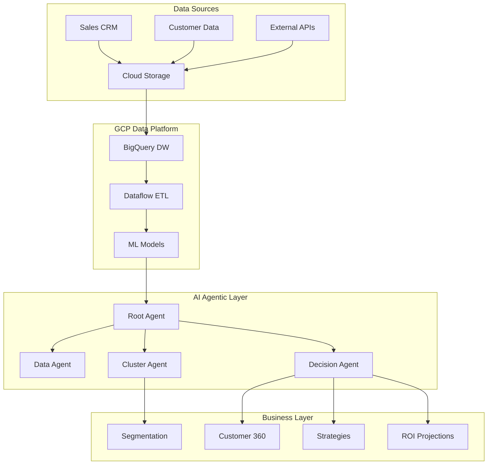

# 🚀 AI-B2Shift: Plataforma Completa de Analytics e IA para Clientes B2B

[](https://opensource.org/licenses/MIT)
[](https://www.python.org/downloads/)
[](https://www.terraform.io/)
[](https://cloud.google.com)

> **Uma solução end-to-end de Analytics e IA Generativa para transformação digital de negócios B2B da TOTVS**

## 📋 Visão Geral

O AI-B2Shift é uma plataforma completa que combina **Data Engineering**, **Machine Learning** e **IA Generativa** para revolucionar a análise de clientes B2B. A solução integra múltiplas tecnologias de ponta para fornecer insights acionáveis, segmentação inteligente e estratégias personalizadas.

### 🎯 Principais Capacidades

- **🤖 AI Agêntico Multi-Agent**: Sistema de IA com agentes especializados para análise de clusterização
- **📊 Data Lake & Warehouse**: Arquitetura completa de dados no GCP com 4 camadas
- **🔬 Machine Learning**: Modelos avançados de clusterização e análise preditiva
- **☁️ Infrastructure as Code**: Deploy automatizado de toda infraestrutura GCP
- **📈 Analytics Avançado**: Dashboards interativos e KPIs de negócio

## 🏗️ Arquitetura da Solução



## 📁 Estrutura do Projeto

```
AI-B2Shift/
├── 📁 AIAgentic/                          # 🤖 Sistema de IA Multi-Agent
│   ├── 📁 b2shift-cluster-agent-adk/      # Agent principal de clusterização
│   ├── 📄 B2Shift_Agentic_AI_*.json       # Configurações de campanha
│   └── 📄 *_Documentacao.docx             # Documentação técnica
├── 📁 AICluster/                          # 🔬 Notebooks de Machine Learning
│   ├── 📄 b2shift_clustering.ipynb        # Análise de clusterização
│   ├── 📄 b2shift_etl_novo.ipynb          # Pipeline de ETL
│   └── 📄 b2shift_etl_refined_*.ipynb     # ETL refinado e otimizado
├── 📁 GCP-IaaC/                           # ☁️ Infrastructure as Code
│   └── 📁 gcp-b2bshift-iac/               # Terraform scripts para GCP
├── 📄 B2Shift - TOTVS Sprint 1 & 2.pdf    # 📋 Documentação de requisitos
└── 📄 EC_Sprint_4_*.pdf                   # 📊 Relatório de resultados
```

## 🚀 Quick Start

### 1. Clone o Repositório

```bash
git clone https://github.com/seu-usuario/AI-B2Shift.git
cd AI-B2Shift
```

### 2. Configure a Infraestrutura GCP

```bash
cd GCP-IaaC/gcp-b2bshift-iac
cp terraform.tfvars.example terraform.tfvars
# Edite terraform.tfvars com seus valores
terraform init
terraform plan
terraform apply
```

### 3. Execute o AI Agent

```bash
cd AIAgentic/b2shift-cluster-agent-adk/b2shift-cluster-agent
poetry install
make quickstart
make demo
```

### 4. Execute Análises de ML

```bash
cd AICluster
jupyter notebook b2shift_clustering.ipynb
```

## 🤖 AI Agentic System

### Arquitetura Multi-Agent

O sistema de IA é composto por agentes especializados que trabalham em conjunto:

```python
┌─────────────────────────────────────────────────────────┐
│                 B2Shift Root Agent                      │
│         (Orquestração e Decisões Estratégicas)         │
└─────────────────┬───────────────────────────────────────┘
                  │
     ┌────────────┼────────────┬──────────────┐
     │            │            │              │
┌────▼────┐ ┌────▼────┐ ┌─────▼─────┐ ┌─────▼─────┐
│  Data   │ │ Cluster │ │ Decision  │ │   Tools   │
│ Agent   │ │  Agent  │ │   Agent   │ │& Utilities│
└─────────┘ └─────────┘ └───────────┘ └───────────┘
```

### Principais Funcionalidades

#### 🔍 Análise de Clusterização
```python
# Exemplo de uso
query = """
Analise os clientes B2B e identifique os principais clusters 
comportamentais com estratégias específicas para cada segmento
"""
result = await agent.analyze(query)
```

#### 📊 Geração de Estratégias
- **Go-to-market** personalizado por cluster
- **Pricing** otimizado por segmento
- **ROI projections** para cada estratégia
- **KPIs** de acompanhamento

#### 🎯 Capacidades do Sistema
- **Segmentação Automática**: K-Means, DBSCAN, Hierarchical
- **Análise Preditiva**: Churn, LTV, Expansion
- **Otimização de Portfolio**: Recursos e investimentos
- **Intelligence de Mercado**: Trends e oportunidades

## 📊 Data Platform (GCP)

### Arquitetura de Dados em 4 Camadas

| Camada | Descrição | Tecnologia | Uso |
|--------|-----------|------------|-----|
| **🔵 Raw** | Dados brutos das fontes | BigQuery | Auditoria, troubleshooting |
| **🟢 Trusted** | Dados limpos e validados | BigQuery | Análises exploratórias |
| **🟡 Refined** | Star Schema para analytics | BigQuery | Dashboards, relatórios |
| **🔴 Analytics** | KPIs e métricas de negócio | BigQuery | Executive dashboards |

### Principais Datasets

#### Fontes de Dados Internas
- **Sales Proposals History**: Histórico de propostas comerciais
- **Customer Stats**: Estatísticas detalhadas dos clientes
- **Recent Contracts**: Contratos ativos e recentes
- **Customer MRR**: Monthly Recurring Revenue
- **NPS Relational**: Pesquisas de satisfação
- **Support Tickets**: Tickets de suporte ao cliente

#### Dados Externos
- **Brazilian Market Data**: Dados de mercado por setor
- **Demographic Data**: Demografia regional

### Stack Tecnológico

| Componente | Tecnologia | Função |
|------------|------------|---------|
| **Data Lake** | Cloud Storage | Armazenamento raw |
| **Data Warehouse** | BigQuery | Analytics OLAP |
| **ETL/ELT** | Dataflow + Dataproc | Processamento |
| **ML Platform** | Vertex AI | Modelos e predictions |
| **Orquestração** | Cloud Composer (Airflow) | Workflows |
| **Governança** | DataPlex | Quality e catalog |

## 🔬 Machine Learning

### Algoritmos de Clusterização

#### K-Means Adaptativo
```python
# Determinação automática do número de clusters
def adaptive_kmeans(data, max_clusters=10):
    silhouette_scores = []
    for k in range(2, max_clusters+1):
        kmeans = KMeans(n_clusters=k, random_state=42)
        labels = kmeans.fit_predict(data)
        score = silhouette_score(data, labels)
        silhouette_scores.append(score)
    
    optimal_k = np.argmax(silhouette_scores) + 2
    return KMeans(n_clusters=optimal_k, random_state=42)
```

#### DBSCAN para Outliers
- Identificação de clientes únicos
- Detecção de comportamentos anômalos
- Tratamento de ruído nos dados

#### Clustering Hierárquico
- Análise de sub-segmentos
- Dendrogramas para visualização
- Relacionamentos entre clusters

### Métricas de Validação

| Métrica | Interpretação | Meta |
|---------|---------------|------|
| **Silhouette Score** | Qualidade da separação | > 0.5 |
| **Davies-Bouldin Index** | Compacidade vs Separação | < 1.0 |
| **Calinski-Harabasz** | Variância inter/intra clusters | > 100 |

## 💰 Valor de Negócio

### Impactos Mensuráveis

| Métrica | Melhoria Esperada | Como Medimos |
|---------|------------------|-------------|
| **Conversão** | +15-25% | Segmentação precisa |
| **Retenção** | +20-30% | Predição proativa de churn |
| **ROI Marketing** | +30-40% | Otimização de portfolio |
| **Eficiência Analítica** | +50-60% | Automação vs processo manual |

### KPIs de Acompanhamento

#### Por Cluster
- **Revenue**: MRR, ARR, LTV
- **Engagement**: NPS, Support tickets, Feature adoption
- **Growth**: Expansion rate, Upsell success
- **Risk**: Churn probability, Health score

#### Operacionais
- **Data Quality**: Completeness, accuracy, freshness
- **Model Performance**: Precision, recall, F1-score
- **System Health**: Uptime, latency, error rates

## 🔧 Configuração e Deploy

### Pré-requisitos

```bash
# Ferramentas necessárias
- Python 3.8+
- Terraform >= 1.3.0
- Google Cloud SDK
- Poetry (Python package manager)
- Docker (opcional)
```

### Configuração do GCP

1. **Criar projeto GCP**
```bash
gcloud projects create seu-projeto-b2shift
gcloud config set project seu-projeto-b2shift
```

2. **Habilitar APIs necessárias**
```bash
gcloud services enable bigquery.googleapis.com
gcloud services enable dataflow.googleapis.com
gcloud services enable aiplatform.googleapis.com
gcloud services enable composer.googleapis.com
```

3. **Configurar credenciais**
```bash
gcloud auth application-default login
```

### Deploy da Infraestrutura

```bash
cd GCP-IaaC/gcp-b2bshift-iac
terraform init
terraform plan -var-file="terraform.tfvars"
terraform apply -auto-approve
```

### Deploy do AI Agent

```bash
cd AIAgentic/b2shift-cluster-agent-adk/b2shift-cluster-agent
poetry install
poetry run adk deploy --create
```

## 📈 Exemplos de Uso

### 1. Análise Básica de Clusters

```python
# Query para análise completa
query = """
Analise os dados de clientes B2B da TOTVS e identifique:
1. Principais clusters comportamentais
2. Características de cada segmento
3. Estratégias recomendadas
4. Projeções de ROI
"""

result = await b2shift_agent.analyze(query)
print(result.insights)
```

### 2. Estratégia para Cluster Específico

```python
query = """
Para o cluster de PMEs tecnológicas:
- Gere estratégia go-to-market
- Defina pricing personalizado  
- Projete ROI em 12 meses
- Estabeleça KPIs de acompanhamento
"""

strategy = await b2shift_agent.generate_strategy(query)
print(strategy.action_plan)
```

### 3. Análise Preditiva

```python
query = """
Analise o cliente ACME Corp e:
- Prediga probabilidade de churn
- Identifique oportunidades de upsell
- Recomende ações preventivas
- Calcule lifetime value projetado
"""

prediction = await b2shift_agent.predict(query)
print(prediction.recommendations)
```

## 📊 Dashboards e Visualizações

### Executive Dashboard
- **Customer 360**: Visão holística por cliente
- **Cluster Performance**: Métricas por segmento
- **Revenue Analytics**: Análises financeiras
- **Market Intelligence**: Insights de mercado

### Operational Dashboard
- **Data Quality**: Health dos pipelines
- **Model Performance**: Métricas de ML
- **System Monitoring**: Saúde da infraestrutura

### Business Intelligence
- **Cohort Analysis**: Análise de coortes
- **Funnel Analysis**: Conversão por etapa
- **Churn Analysis**: Fatores de abandono

## 🔒 Segurança e Compliance

### Data Security
- **Encryption**: At rest e in transit (AES-256)
- **Access Control**: IAM roles granulares
- **Data Masking**: Proteção de PII em dev/test
- **Audit Logging**: Rastreamento completo

### Compliance
- **LGPD**: Conformidade com lei brasileira
- **SOX**: Controles para dados financeiros
- **ISO 27001**: Padrões internacionais
- **SOC 2**: Security e availability controls

### Model Security
- **Input Validation**: Sanitização rigorosa
- **Output Filtering**: Prevenção de data leakage
- **Prompt Injection Protection**: Defesas avançadas
- **Model Versioning**: Controle e rollbacks

## 🚀 Roadmap

### Q1 2024
- [x] ✅ **Infraestrutura GCP**: Deploy completo
- [x] ✅ **AI Multi-Agent**: Sistema funcional
- [x] ✅ **ML Clustering**: Algoritmos implementados
- [x] ✅ **Data Pipeline**: ETL automatizado

### Q2 2024
- [ ] 🔄 **API REST**: Endpoints para integração
- [ ] 🔄 **Real-time Analytics**: Streaming de dados
- [ ] 🔄 **Advanced ML**: Deep learning models
- [ ] 🔄 **Mobile App**: Dashboard mobile

### Q3 2024
- [ ] 📋 **Auto-ML**: AutoML para otimização
- [ ] 📋 **Edge Computing**: Deploy em edge
- [ ] 📋 **Multi-tenant**: Suporte a múltiplos clientes
- [ ] 📋 **Advanced Security**: Zero-trust architecture

### Q4 2024
- [ ] 📋 **Global Expansion**: Deploy multi-region
- [ ] 📋 **AI Explainability**: Modelos interpretáveis
- [ ] 📋 **Federated Learning**: ML distribuído
- [ ] 📋 **Quantum-ready**: Preparação para quantum computing

## 👥 Equipe e Contribuição

### Core Team
- **Data Science**: Implementação de algoritmos ML
- **Engineering**: Arquitetura e infraestrutura
- **Product**: Definição de features e UX
- **Business**: Estratégias e validação de valor

### Como Contribuir

1. **Fork** o projeto
2. **Crie** uma branch (`git checkout -b feature/nova-feature`)
3. **Commit** suas mudanças (`git commit -am 'Add: nova feature'`)
4. **Push** para a branch (`git push origin feature/nova-feature`)
5. **Abra** um Pull Request

### Coding Standards
- **Python**: PEP 8, type hints, docstrings
- **Terraform**: HCL best practices, modules
- **SQL**: Style guide para queries
- **Documentation**: Markdown, diagramas Mermaid

## 📞 Suporte e Contato

### Canais de Suporte
- **📧 Email**: data-team@b2shift.com
- **💬 Slack**: #ai-b2shift
- **🐛 Issues**: GitHub Issues para bugs
- **💡 Discussions**: GitHub Discussions para ideias

### Documentação Adicional
- **📚 Wiki**: [Documentação completa](docs/)
- **🎥 Videos**: [Tutoriais no YouTube](https://youtube.com/ai-b2shift)
- **📖 Blog**: [Medium Blog](https://medium.com/@ai-b2shift)
- **🎓 Courses**: [Udemy Course](https://udemy.com/ai-b2shift)

## 📄 Licença

Este projeto está licenciado sob a **MIT License**. Veja o arquivo [LICENSE](LICENSE) para detalhes.

---

## 🎊 Agradecimentos

Agradecemos à **TOTVS** pela parceria e confiança, e a toda equipe que tornou este projeto possível. Este é um exemplo de como **Data Science**, **IA Generativa** e **Cloud Computing** podem transformar negócios B2B.

### Partners & Sponsors
- **🏢 TOTVS**: Parceiro estratégico e sponsor principal
- **☁️ Google Cloud**: Infraestrutura e ML Platform
- **🤖 OpenAI/Google**: Modelos de IA Generativa
- **📊 Looker**: Business Intelligence Platform

---

<div align="center">

**🚀 AI-B2Shift: Transformando o Futuro dos Negócios B2B com IA 🚀**

[](https://github.com/seu-usuario/AI-B2Shift/stargazers)
[](https://github.com/seu-usuario/AI-B2Shift/network)
[](https://linkedin.com/company/ai-b2shift)

*Feito com ❤️ pela equipe AI-B2Shift*

</div>
